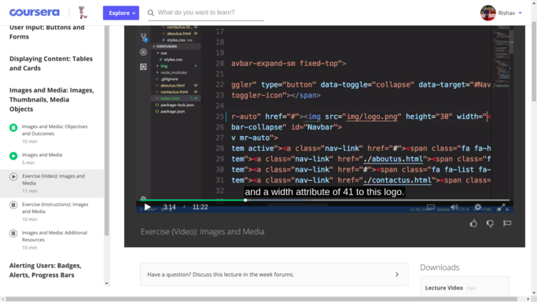
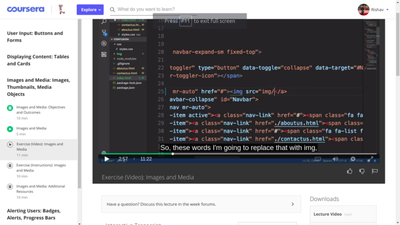

# Coursera Video Page Floating Fix

Recently I encountered a issue on Coursera page, while watching the videos, page starts floating Horizontally, which was quite irritating. After ispecting it from chrome developers tool, I figured out some issue of some CSS Stying.

Thus, I've created a small extension for chrome browser, which overrides the css of particular class , whenever any of video page of coursera is opened in the browser.

### Before using the extension:-  

   
### After using the extension:-  

#### Follow the Guidelines below to Download the extension:-

- Installing the extension locally
  - Download the file from [here](https://github.com/rishav-pandey/chrome-extension-for-coursera-page-floating-fix/archive/master.zip)
  - Navigate to chrome://extensions
  - Expand the Developer dropdown menu and click “Load Unpacked - Extension”
  - Delete the **images folder** and **README.md** file from downloaded file
  - Navigate to the local folder containing the extension’s code and click Ok
  - Assuming there are no errors, the extension should load into your browser
- Click [here]() to install it directly
